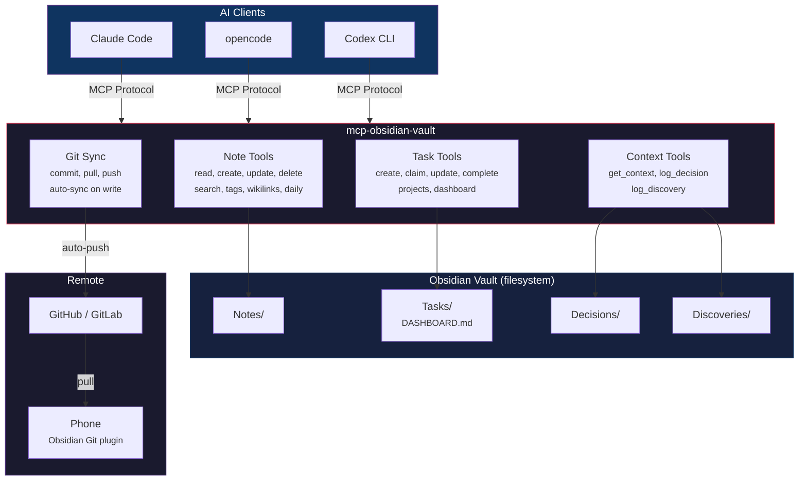
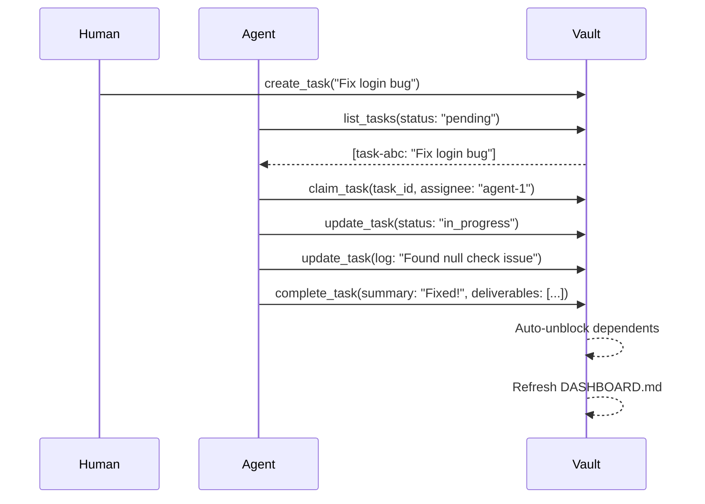
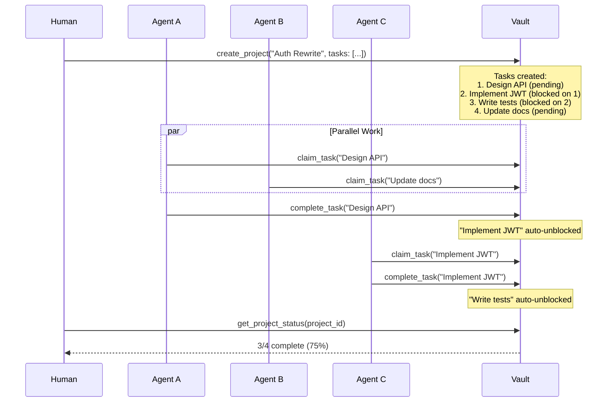
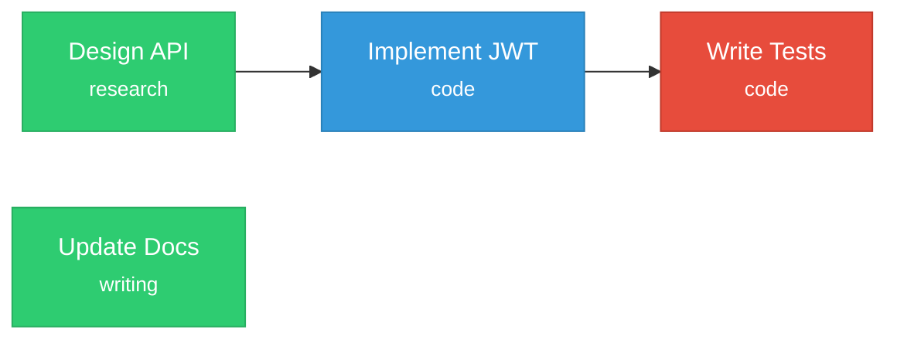
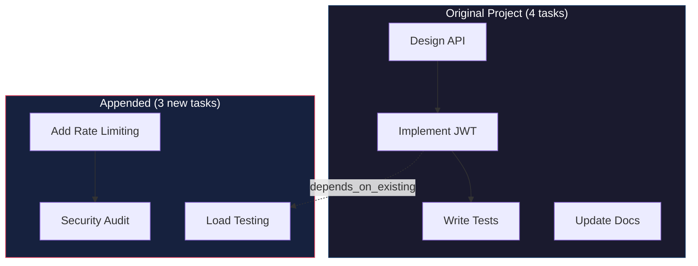
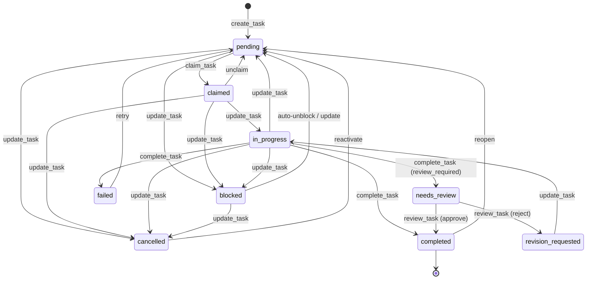
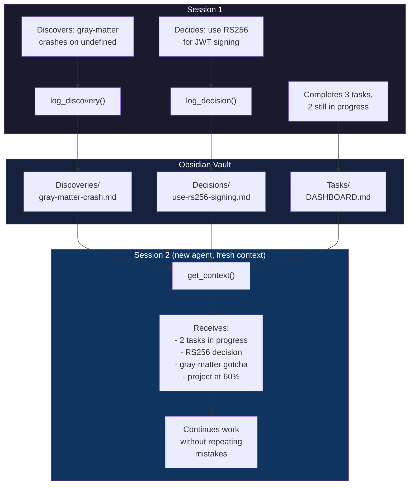
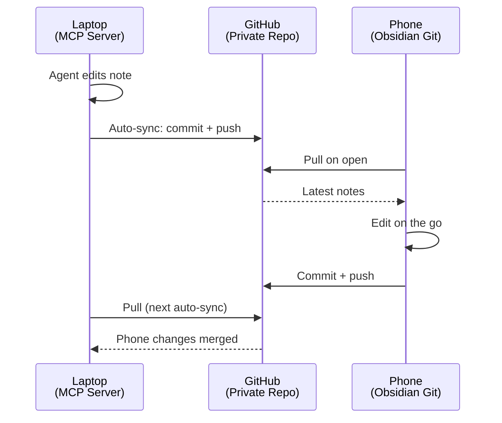

<div align="center">

# mcp-obsidian-vault

**Turn your Obsidian vault into an AI command center.**

[](https://www.npmjs.com/package/mcp-obsidian-vault)
[](https://github.com/t-rhex/obsidian-mcp-server/actions)
[](https://nodejs.org)
[](LICENSE)

An MCP server that gives AI agents direct filesystem access to your Obsidian vault — no Obsidian running required. Manage notes, orchestrate multi-agent task workflows, persist context across sessions, and sync everything with git.

[Quick Start](#quick-start) &bull; [Tools](#tools-27) &bull; [Task Orchestration](#task-orchestration) &bull; [Configuration](#configuration)

</div>

---

## Why This Exists

Every time you start a new AI chat session, your agent forgets everything. Decisions made, bugs discovered, tasks in progress — all gone.

**mcp-obsidian-vault** solves this by making your Obsidian vault the single source of truth for AI development work:

- **Notes** are your knowledge base — searchable, linked, tagged
- **Tasks** are your work queue — agents claim, track, and complete them
- **Projects** orchestrate multi-agent parallel work with dependency graphs
- **Decisions & Discoveries** persist the *why* so future sessions don't repeat mistakes
- **Context briefings** give any new session a full situation report in one call

```
npx mcp-obsidian-vault
```

---

## How It Works



---

## Features

### Vault Management
| Feature | Description |
|---------|-------------|
| **CRUD Notes** | Read, create, update, delete with full YAML frontmatter support |
| **Wikilinks** | Resolve `[[links]]`, find backlinks, outlinks, and broken links |
| **Full-Text Search** | Regex-capable search with folder filtering and timeout protection |
| **Tag Management** | Add, remove, list tags with automatic deduplication |
| **Daily Notes** | Get, create, append by date — `today`, `yesterday`, `2025-03-08` |
| **Vault Browsing** | Recursive directory listing with depth control |

### Task Orchestration
| Feature | Description |
|---------|-------------|
| **Agent Task Queue** | Structured tasks with priority, type, scope, and deadlines |
| **Atomic Claims** | Race-condition-safe task claiming for multi-agent setups |
| **Dependency Graphs** | Tasks block/unblock automatically based on `depends_on` |
| **Project Management** | Create projects with sub-tasks, track rollup progress |
| **Append Mode** | Add new sub-tasks to existing projects with `project_id` |
| **Conditional Workflows** | Routing rules: branch task execution based on output (v0.3) |
| **Auto Dashboard** | `DASHBOARD.md` regenerated after every mutation |

### Human-in-the-Loop (v0.3)
| Feature | Description |
|---------|-------------|
| **Review Gates** | Tasks with `review_required` redirect to `needs_review` on completion |
| **Approve / Reject** | `review_task` tool for humans/agents to approve, reject, or request changes |
| **Feedback Loop** | Rejected tasks enter `revision_requested` → agents revise → resubmit |
| **Risk Levels** | Tag tasks as `low` / `medium` / `high` / `critical` risk |

### Agent Management (v0.3)
| Feature | Description |
|---------|-------------|
| **Agent Registry** | Register agents with capabilities, tags, and model info |
| **Capability Routing** | `suggest_assignee` recommends the best agent for a task |
| **Timeout Detection** | `check_timeouts` scans for overdue tasks with auto-retry and escalation |
| **Usage Tracking** | Record and aggregate token usage and cost per agent/task/project |
| **Webhook Events** | Fire HTTP POST notifications on task lifecycle events |

### Context Persistence
| Feature | Description |
|---------|-------------|
| **Session Briefings** | `get_context` returns full situation report for new sessions |
| **Decision Records** | Log architectural decisions with rationale and alternatives |
| **Discovery Notes** | Capture gotchas, TILs, and patterns for future agents |
| **Project Filtering** | Scope context briefings to a specific project |

### Git Sync
| Feature | Description |
|---------|-------------|
| **Auto-Sync** | Commit + push after every write (debounced) |
| **Manual Control** | commit, pull, push, sync, diff, log, init, remote management |
| **Cross-Device** | Laptop-to-phone sync via Obsidian Git plugin |

---

## Quick Start

```bash
npx mcp-obsidian-vault
```

### Claude Desktop

```json
{
  "mcpServers": {
    "obsidian": {
      "command": "npx",
      "args": ["-y", "mcp-obsidian-vault"],
      "env": {
        "OBSIDIAN_VAULT_PATH": "/path/to/your/vault"
      }
    }
  }
}
```

### opencode

opencode has no `env` field — use `sh -c` with inline env vars:

```json
{
  "mcp": {
    "obsidian": {
      "type": "local",
      "command": [
        "sh", "-c",
        "OBSIDIAN_VAULT_PATH=/path/to/your/vault GIT_AUTO_SYNC=true npx -y mcp-obsidian-vault"
      ],
      "enabled": true
    }
  }
}
```

### Codex CLI

```toml
[mcp_servers.obsidian]
command = "npx"
args = ["-y", "mcp-obsidian-vault"]

[mcp_servers.obsidian.env]
OBSIDIAN_VAULT_PATH = "/path/to/your/vault"
GIT_AUTO_SYNC = "true"
```

### From Source

```bash
git clone https://github.com/t-rhex/obsidian-mcp-server.git
cd obsidian-mcp-server
npm install && npm run build
OBSIDIAN_VAULT_PATH=/path/to/vault node build/index.js
```

---

## Tools (27)

### Note Tools

<details>
<summary><code>read_note</code> — Read a note's content, frontmatter, tags, and metadata</summary>

```
path: "Projects/my-note.md"     # .md added automatically if missing
includeRaw: false                # include unparsed content
```
</details>

<details>
<summary><code>create_note</code> — Create a note with optional YAML frontmatter (parent folders auto-created)</summary>

```
path: "Projects/new-idea"
content: "# My Idea\n\nSome content here."
frontmatter: { "tags": ["idea", "project"], "status": "draft" }
overwrite: false                 # fails if note exists (default)
```
</details>

<details>
<summary><code>update_note</code> — Replace, append, or prepend content; merge frontmatter</summary>

```
path: "Projects/my-note"
content: "## New Section\n\nAdded content."
mode: "append"                   # "replace" | "append" | "prepend"
frontmatter: { "status": "in-progress" }
```
</details>

<details>
<summary><code>delete_note</code> — Delete a note (moves to .trash/ by default)</summary>

```
path: "Projects/old-note"
permanent: false                 # true for hard delete
```
</details>

<details>
<summary><code>search_vault</code> — Full-text search with regex support</summary>

```
query: "meeting notes"
regex: false
caseSensitive: false
folder: "Projects"               # limit to subfolder
maxResults: 20
```
</details>

<details>
<summary><code>list_vault</code> — Browse vault file and folder structure</summary>

```
path: "Projects"                 # defaults to vault root
recursive: true
maxDepth: 5
notesOnly: false                 # true to filter to .md files only
```
</details>

<details>
<summary><code>manage_tags</code> — Read, add, or remove frontmatter tags</summary>

```
path: "Projects/my-note"
action: "add"                    # "list" | "add" | "remove"
tags: ["important", "review"]
```
</details>

<details>
<summary><code>daily_note</code> — Get, create, or append to daily notes</summary>

```
action: "append"                 # "get" | "create" | "append"
date: "today"                    # "today" | "yesterday" | "tomorrow" | "2025-03-08"
content: "- Met with team about roadmap"
```
</details>

<details>
<summary><code>wikilinks</code> — Navigate [[wikilinks]]: resolve, backlinks, outlinks, unresolved</summary>

```
action: "backlinks"              # "resolve" | "backlinks" | "outlinks" | "unresolved"
path: "Projects/my-note"
```

| Action | Description |
|--------|-------------|
| `resolve` | Find the file a `[[wikilink]]` points to |
| `backlinks` | Find all notes that link TO a given note |
| `outlinks` | List all `[[wikilinks]]` FROM a note |
| `unresolved` | Find all broken `[[wikilinks]]` across the vault |
</details>

<details>
<summary><code>git_sync</code> — Git version control: commit, pull, push, sync, diff, log, init</summary>

```
action: "sync"                   # full pull + commit + push
message: "update notes"          # optional commit message
```

| Action | Description |
|--------|-------------|
| `status` | Working tree status |
| `commit` | Stage all + commit |
| `pull` | Pull from remote (rebase by default) |
| `push` | Push to remote |
| `sync` | Pull + commit + push in one call |
| `log` | Recent commit history |
| `diff` | Uncommitted changes |
| `init` | Initialize git repo with `.gitignore` |
| `remote_add` | Add a git remote |
| `remote_list` | List configured remotes |
</details>

### Task Tools

<details>
<summary><code>create_task</code> — Create a task in the agent work queue</summary>

```
title: "Implement auth module"
description: "Build JWT-based authentication for the API."
priority: "high"                 # "critical" | "high" | "medium" | "low"
type: "code"                     # "code" | "research" | "writing" | "maintenance" | "other"
depends_on: ["task-abc-123"]     # task IDs that must complete first
scope: ["src/auth.ts"]           # advisory: files this task modifies
acceptance_criteria: ["Tests pass", "Docs written"]
timeout_minutes: 120
```
</details>

<details>
<summary><code>list_tasks</code> — Query tasks by status, priority, type, tags, or assignee</summary>

```
status: "pending"                # or "all"
priority: "high"                 # or "all"
type: "code"                     # or "all"
tags: ["auth"]                   # filter by tags
assignee: "claude-code-1"
unassigned_only: true
project: "proj-..."              # filter by project
```
</details>

<details>
<summary><code>claim_task</code> — Atomically claim a task (race-condition safe)</summary>

```
task_id: "task-2026-03-09-abc123"
assignee: "claude-code-1"
```

Blocks if dependencies aren't met. Two agents claiming the same task &rarr; second gets `TASK_ALREADY_CLAIMED`.
</details>

<details>
<summary><code>update_task</code> — Update status, priority, or append to Agent Log</summary>

```
task_id: "task-2026-03-09-abc123"
status: "in_progress"
log_entry: "Found root cause — null check missing in auth middleware."
```
</details>

<details>
<summary><code>complete_task</code> — Mark done/failed/cancelled with summary and deliverables</summary>

```
task_id: "task-2026-03-09-abc123"
summary: "Auth module implemented with JWT support."
deliverables: ["src/auth.ts", "https://github.com/org/repo/pull/42"]
status: "completed"              # "completed" | "failed" | "cancelled"
```

Completing a task auto-unblocks dependent tasks (`blocked` &rarr; `pending`).
</details>

<details>
<summary><code>create_project</code> — Create a project with sub-tasks and dependency graph</summary>

**New project:**
```
title: "Auth Rewrite"
description: "Rewrite authentication to use JWT tokens."
tasks: [
  { title: "Design API schema", type: "research" },
  { title: "Implement JWT", type: "code", depends_on_indices: [0] },
  { title: "Write tests", type: "code", depends_on_indices: [1] },
  { title: "Update docs", type: "writing" }
]
```

**Append to existing project:**
```
project_id: "proj-2026-03-09-abc123"
tasks: [
  { title: "Add rate limiting", type: "code" },
  { title: "Security audit", depends_on_existing: ["task-..."] }
]
```
</details>

<details>
<summary><code>get_project_status</code> — Rollup progress, active agents, blockers</summary>

```
project_id: "proj-2026-03-09-abc123"
```

Returns progress percentage, status breakdown, active agents, overdue tasks, and blockers.
</details>

### Context Tools

<details>
<summary><code>get_context</code> — Full situation briefing for new sessions</summary>

```
project_id: "proj-..."           # optional: focus on one project
hours: 48                         # lookback window (default: 48)
include_completed: true
```

Returns: active projects, in-progress work, pending tasks, blockers, failures, overdue tasks, recent decisions, recent discoveries, pinned notes.
</details>

<details>
<summary><code>log_decision</code> — Record architectural decisions with rationale</summary>

```
title: "Use JWT over session tokens"
context: "Need stateless auth for microservices."
decision: "JWT with RS256, 15min access tokens, refresh rotation."
alternatives: ["Session tokens with Redis", "API keys"]
consequences: ["Stateless (good)", "Revocation needs deny-list (tradeoff)"]
```
</details>

<details>
<summary><code>log_discovery</code> — Capture gotchas, TILs, and patterns</summary>

```
title: "gray-matter crashes on undefined values"
discovery: "js-yaml throws when serializing undefined. Strip before serialize."
impact: "high"
recommendation: "Filter with Object.entries().filter() first."
category: "bug"
```
</details>

### Review & HITL Tools

<details>
<summary><code>review_task</code> — Approve, reject, or request changes on tasks in review</summary>

```
task_id: "task-2026-03-09-abc123"
action: "approve"                # "approve" | "reject" | "request_changes"
reviewer: "human-alice"
feedback: "Looks good, ship it."  # required for reject/request_changes
```

On approve, the task moves to `completed` and dependents are unblocked. On reject/request_changes, the task moves to `revision_requested` for the assignee to revise and resubmit.
</details>

### Agent Tools

<details>
<summary><code>register_agent</code> — Register an agent with capabilities and metadata</summary>

```
agent_id: "claude-code-1"
capabilities: ["code", "research", "writing"]
tags: ["auth", "backend"]
model: "claude-sonnet-4"
max_concurrent: 3
```

Creates/updates an agent profile in the `Agents/` folder. Agents are tracked with status (`active`, `idle`, `offline`) and heartbeat timestamps.
</details>

<details>
<summary><code>list_agents</code> — Query registered agents with filters</summary>

```
capability: "code"               # filter by capability
tag: "auth"                      # filter by tag
status: "active"                 # "active" | "idle" | "offline"
available_only: true             # only agents below max_concurrent
```
</details>

<details>
<summary><code>suggest_assignee</code> — Get capability-based agent recommendations for a task</summary>

```
task_id: "task-2026-03-09-abc123"
```

Returns a ranked list of agents sorted by capability match, tag overlap, and current workload.
</details>

<details>
<summary><code>check_timeouts</code> — Scan for overdue tasks, apply retry and escalation</summary>

```
dry_run: false                   # true for preview without changes
```

Scans all claimed/in_progress tasks for `timeout_minutes` violations. For overdue tasks:
- If `retry_count < max_retries`: resets to `pending` for retry
- If retries exhausted + `escalate_to` set: marks as escalated
- Returns list of all actions taken
</details>

### Usage Tracking Tools

<details>
<summary><code>log_usage</code> — Record token usage and cost for an interaction</summary>

```
agent_id: "claude-code-1"
task_id: "task-abc-123"          # optional
input_tokens: 15000
output_tokens: 3000
model: "claude-sonnet-4"
cost_usd: 0.042
duration_seconds: 30
notes: "Implemented auth module"
```
</details>

<details>
<summary><code>get_usage_report</code> — Aggregate usage stats with filters and grouping</summary>

```
agent_id: "claude-code-1"       # optional filter
project_id: "proj-..."          # optional filter
task_id: "task-..."             # optional filter
from_date: "2026-03-01"        # optional
to_date: "2026-03-09"          # optional
```

Returns: `total_input_tokens`, `total_output_tokens`, `total_cost_usd`, `record_count`, grouped by agent and model.
</details>

---

## Task Orchestration

### Single Agent Workflow



### Multi-Agent Project Workflow



### Task Dependency Graph


<div align="center">
<small>Green = claimable immediately &nbsp;|&nbsp; Blue = blocked &nbsp;|&nbsp; Red = blocked (2 levels deep)</small>
</div>

### Append Mode — Growing Projects

When requirements evolve mid-project, append new tasks to an existing project without recreating it:



```
create_project(
  project_id: "proj-...",              // existing project
  tasks: [
    { title: "Add Rate Limiting", type: "code" },
    { title: "Security Audit", depends_on_indices: [0] },
    { title: "Load Testing", depends_on_existing: ["task-implement-jwt-id"] }
  ]
)
```

### Task State Machine



---

## Context Persistence

The core problem: **AI agents lose all context between sessions.** Decisions, discoveries, and in-flight work vanish.

mcp-obsidian-vault solves this with three tools that build a persistent knowledge layer:



### Context-First Discipline

Every new session should start with one call:

```
get_context() → {
  active_projects: [{ id, title, progress: "3/7 (43%)" }],
  in_progress: [{ id, title, assignee, claimed_at }],
  pending_work: { "proj-abc": [...], standalone: [...] },
  blockers: [{ id, title, waiting_on: [{ id, title }] }],
  recent_decisions: [{ title, decision, status }],
  recent_discoveries: [{ title, discovery, recommendation }],
  pinned_notes: [...]
}
```

---

## Git Sync & Cross-Device Flow



### Setup

1. **Laptop** — set `GIT_AUTO_SYNC=true` with a private GitHub repo
2. **Phone (iOS)** — [Obsidian Git](https://github.com/Vinzent03/obsidian-git) plugin or [Working Copy](https://workingcopy.app/)
3. **Phone (Android)** — [Obsidian Git](https://github.com/Vinzent03/obsidian-git) plugin (built-in git on Android)

| Obsidian Git Setting | Value | Why |
|---------------------|-------|-----|
| Auto pull on open | Enabled | Get latest when you open the app |
| Auto push after commit | Enabled | Push edits immediately |
| Pull on interval | 5-10 min | Catch changes while app is open |
| Commit message | `mobile: {{date}}` | Distinguish mobile vs MCP commits |

> **Use a private repo.** Your notes are personal.

---

## Task Note Structure

Tasks are markdown notes in `Tasks/` with structured YAML frontmatter:

```markdown
---
id: task-2026-03-09-abc123
title: Implement auth module
status: in_progress
priority: high
type: code
assignee: claude-code-1
created: "2026-03-09T14:00:00.000Z"
updated: "2026-03-09T15:45:00.000Z"
depends_on: []
scope:
  - src/auth.ts
tags:
  - auth
---

## Description

Build JWT-based authentication for the API.

## Acceptance Criteria

- [ ] Tests pass
- [ ] Docs written

## Agent Log

- **[2026-03-09 14:30:00]** Starting implementation. Found 3 endpoints to modify.
- **[2026-03-09 15:45:00] [COMPLETED]** Auth module done with JWT support.

## Deliverables

- src/auth.ts
- src/auth.test.ts
```

A `DASHBOARD.md` is auto-generated after every task mutation with summary counts, active work, pending queue, blockers, and recent completions.

---

## Agent Prompts

Three built-in MCP prompts for different agent personas:

| Prompt | Role | Use When |
|--------|------|----------|
| `task-worker` | Find, claim, complete tasks | Spawning a coding agent |
| `project-manager` | Plan projects, decompose work, monitor | Orchestrating multi-agent work |
| `vault-assistant` | Read, search, organize notes | General vault management |

Request via MCP:

```json
{
  "method": "prompts/get",
  "params": {
    "name": "task-worker",
    "arguments": { "agent_id": "claude-1", "project_id": "proj-abc" }
  }
}
```

Or copy from [`prompts/`](./prompts) into your agent's system prompt.

---

## Configuration

### Required

| Variable | Description |
|----------|-------------|
| `OBSIDIAN_VAULT_PATH` | Absolute path to your vault |

### Vault

| Variable | Default | Description |
|----------|---------|-------------|
| `DAILY_NOTE_FOLDER` | `Daily Notes` | Subfolder for daily notes |
| `TRASH_ON_DELETE` | `true` | Move to `.trash/` instead of permanent delete |
| `MAX_FILE_SIZE_BYTES` | `10485760` | Max file size (10 MB) |
| `MAX_SEARCH_RESULTS` | `50` | Max search results |
| `SEARCH_TIMEOUT_MS` | `30000` | Search timeout |
| `NOTE_EXTENSIONS` | `.md,.markdown` | Note file extensions |
| `TASKS_FOLDER` | `Tasks` | Task notes subfolder |
| `DECISIONS_FOLDER` | `Decisions` | Decision records subfolder |
| `DISCOVERIES_FOLDER` | `Discoveries` | Discovery notes subfolder |
| `AGENTS_FOLDER` | `Agents` | Agent profile notes subfolder |
| `USAGE_FOLDER` | `Usage` | Token usage records subfolder |

### Git

| Variable | Default | Description |
|----------|---------|-------------|
| `GIT_AUTO_SYNC` | `false` | Auto commit + push after every write |
| `GIT_AUTO_SYNC_DEBOUNCE_MS` | `5000` | Debounce interval |
| `GIT_COMMIT_MESSAGE_PREFIX` | `vault: ` | Auto-commit message prefix |
| `GIT_REMOTE` | `origin` | Default remote |
| `GIT_BRANCH` | `main` | Default branch |
| `GIT_TIMEOUT_MS` | `30000` | Git operation timeout |
| `GIT_PULL_REBASE` | `true` | Use `--rebase` on pull |

### Webhooks

| Variable | Default | Description |
|----------|---------|-------------|
| `WEBHOOK_URL` | — | Comma-separated webhook URLs for task event notifications |
| `WEBHOOK_SECRET` | — | HMAC-SHA256 secret for signing webhook payloads |
| `WEBHOOK_TIMEOUT_MS` | `5000` | Webhook HTTP request timeout |

---

## Security

- **Path traversal prevention** — all paths validated against vault root, including symlink resolution
- **No shell injection** — git commands use `execFile` (not `exec`)
- **Atomic writes** — temp file + rename prevents partial writes on crash
- **Overwrite protection** — `create_note` fails if note exists unless explicitly overridden
- **Trash safety** — unique filenames prevent collision in `.trash/`
- **File size limits** — configurable cap prevents reading huge files
- **Search timeout** — prevents runaway searches
- **Git mutex** — prevents concurrent git commands from conflicting

---

## Robustness

- **Retry failed tasks** — `update_task(status: "pending")` clears assignee, increments `retry_count`
- **Unclaim stuck tasks** — reclaim tasks from crashed agents
- **Timeout detection** — `list_tasks` flags tasks past `timeout_minutes` with `is_overdue: true`
- **Dependency validation** — warns on nonexistent `depends_on` references
- **Dashboard health** — all mutation responses include `dashboard_refreshed` status

### Known Limitations

- **No file locking** — claims are atomic within a single server process (Node event loop). Multiple server processes sharing a vault need external coordination.
- **Scope is advisory** — `scope[]` is not enforced by the server. Agents should respect it.
- **Timeouts need `check_timeouts`** — overdue tasks are detected but not auto-released; an agent or cron must call `check_timeouts` periodically.
- **Webhooks are fire-and-forget** — webhook delivery is best-effort with one retry. No persistent queue.

---

## Project Structure

```
src/
├── index.ts              # MCP server entry, 27 tools + 3 prompts
├── config.ts             # Environment variable parsing
├── errors.ts             # Typed errors + safe handler wrapper
├── vault.ts              # Filesystem: path safety, atomic writes, list, search
├── frontmatter.ts        # YAML parse/serialize, tag extraction
├── git.ts                # Git CLI wrapper with mutex
├── events.ts             # EventBus with typed task lifecycle events
├── webhooks.ts           # WebhookEmitter with HMAC-SHA256 signing
├── agent-registry.ts     # Agent profiles, scanning, capability matching
├── task-schema.ts        # Task types, IDs, validation, state machine
├── task-dashboard.ts     # Task scanning + DASHBOARD.md generation
├── prompts.ts            # MCP prompt registration
└── tools/                # One file per tool (27 files)

prompts/                  # Agent persona prompts (ship with npm)
skills/                   # Agent skills (ship with npm, skills.sh compatible)
test/run.mjs              # 317 integration tests
```

---

## Development

```bash
npm install
npm run build             # TypeScript → build/
npm test                  # 317 integration tests
npm run dev               # tsc --watch
```

---

## License

MIT
